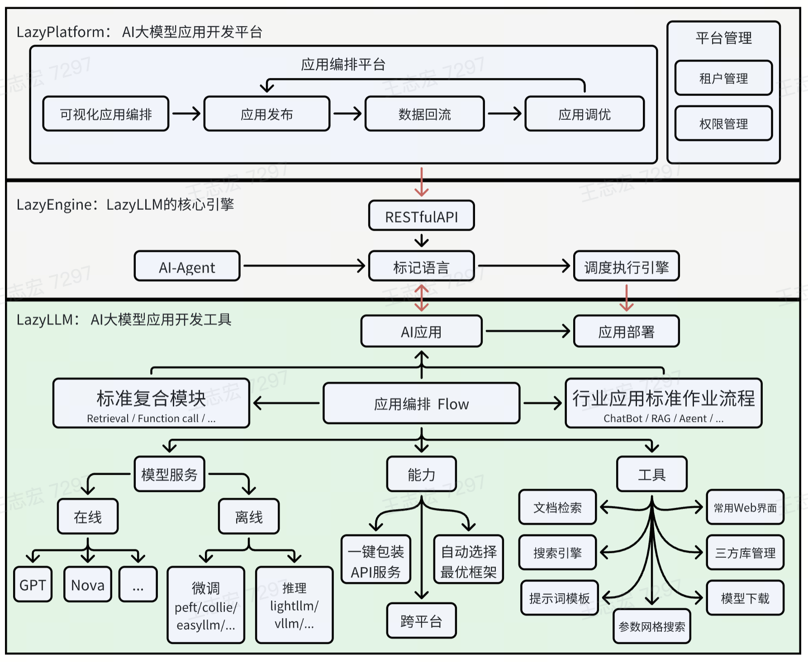

# LazyLLM: 构建和优化多Agent应用的一站式开发工具。
[中文](README.md) |  [EN](README.ENG.md)

## 一、简介

LazyLLM为应用开发过程中的全部环节（包括应用搭建、数据准备、模型部署、模型微调、评测等）提供了大量的工具，协助开发者用极低的成本构建AI应用，并可以持续的迭代优化效果。

## 二、特性

**高效的多Agent AI应用构建**：轻松组建包含多个Agent的AI应用，并提供一键部署所有子服务的能力。LazyLLM通过一套轻量的网关机制，简化了多Agent应用的部署流程，解决了传统方法中需依次启动各个子模块（如LLM、Embedding等）服务并配置URL的问题，使整个过程更加顺畅高效。<br>

**跨平台兼容**：无需修改代码，即可一键切换IaaS平台，兼容裸金属服务器、开发机、Slurm集群、公有云等。这使得开发好的应用可以无缝迁移到其他IaaS平台，大大减少了代码修改的工作量。<br>

**支持网格搜索参数优化**：根据用户配置，自动尝试不同的基模型、召回策略和微调参数，对应用进行评测和优化。这使得超参数调优过程无需对应用代码进行大量侵入式修改，提高了调优效率，帮助用户快速找到最佳配置。<br>

**高效的模型微调**：支持对应用中的模型进行微调，持续提升应用效果。根据微调场景，自动选择最佳的微调框架和模型切分策略。这不仅简化了模型迭代的维护工作，还让算法研究员能够将更多精力集中在算法和数据迭代上，而无需处理繁琐的工程化任务。<br>

## 三、使用指南

LazyLLM可用来构建常用的人工智能应用，下面给出一些例子。

### 3.1 对话机器人

```python
t = lazyllm.OnlineChatModule('llama2-7b', stream=True)
w = lazyllm.WebModule(t)
w.start()
```

### 3.2 检索增强生成

### 3.3 故事创作

### 3.4 智能体

## 四、功能点

1. **应用搭建**：定义了pipeline、parallel、diverter、if、switch、loop等工作流(Flow)，开发者可以基于任意的函数和模块来快速搭建多Agent的AI应用。支持对组装好的多Agent应用进行一键部署，也支持对应用进行部分或者全部的更新。
2. **跨平台**： 支持用户在不同的算力平台上获得一致的使用体验。目前兼容裸金属、Slurm、SenseCore等多种算力平台。
3. **支持大模型的微调和推理**
    * 离线(本地)模型服务：
        + 支持微调框架：collie、peft
        + 支持推理框架：lightllm、vllm
        + 支持根据用户场景自动选择最合适的框架和模型参数(如micro-bs、tp、zero等)。
    * 在线服务：
        + 支持微调服务：GPT、SenseNova、通义千问
        + 支持推理服务：GPT、SenseNova、Kimi、智谱、通义千问
        + 支持Embedding推理服务：Openai、SenseNova、GLM、通义千问
4. **支持RAG常用组件**：Document、Parser、Retriever、Reranker等。
5. **基础的界面支持**：如聊天界面、文档管理界面等。

## 五、安装

仅安装lazyllm及必要的依赖，可以使用
```bash
pip install lazyllm
```

安装lazyllm及所有的依赖，可以使用
```bash
pip install lazyllm-full
```

## 六、设计理念

LazyLLM的设计理念源自对我们对大模型在生产环境表现出的局限性的深刻洞察，我们深知现阶段的大模型尚无法完全端到端地解决所有实际问题。因此，基于LazyLLM的AI应用构建流程强调“快速原型搭建，结合场景任务数据进行bad-case分析，针对关键环节进行算法尝试和模型微调，从而提升整个应用的效果”。LazyLLM处理了这个过程中繁琐的工程化工作，提供便捷的操作接口，让用户能够集中精力提升算法效果，打造出色的AI应用。<br>

LazyLLM的设计目标是让算法研究员和开发者能够能够从繁杂的工程实现中解脱出来，从而专注于他们最擅长的领域：算法和数据，解决他们在实际场景中的问题。无论你是初学者还是资深专家，我希望LazyLLM都能为你提供一些帮助。对于初级开发者，LazyLLM彻底简化了AI应用的构建过程。他们无需再考虑如何将任务调度到不同的IaaS平台上，不必了解API服务的构建细节，也无需在微调模型时选择框架或切分模型，更不需要掌握任何Web开发知识。通过预置的组件和简单的拼接操作，初级开发者便能轻松构建出具备生产价值的工具。而对于资深的专家，LazyLLM提供了极高的灵活性，每个模块都支持定制和扩展，使用户能够轻松集成自己的算法以及业界先进的生产工具，打造更为强大的应用。<br>

与市面上多数框架不同，LazyLLM在每个环节都精挑细选了2-3个我们认为最具优势的工具进行集成。这不仅简化了用户选择的过程，还确保了用户能够以最低的成本，搭建出最具生产力的应用。我们不追求工具或模型的数量，而是专注于质量和实际效果，致力于提供最优的解决方案。<br>

总之，LazyLLM旨在为AI应用构建提供一条快速、高效、低门槛的路径，解放开发者的创造力，推动AI技术在实际生产中的落地和普及。<br>

## 七、架构说明



## 八、基本概念

### Component

Component是LazyLLM中最小的执行单元，它既可以是一个函数，也可以是一个bash命令。Component具备三个典型的能力：
1. 能借助launcher，实现用户无感的跨平台。
  - EmptyLauncher：本地运行，支持开发机、裸金属等；
  - RemoteLauncher：调度到计算节点运行，支持Slurm、SenseCore等。
2. 利用注册机制，实现方法的分组索引和快速查找。支持对函数和bash命令进行注册。下面是一个例子：
```python
import lazyllm
lazyllm.component_register.new_group('demo')

@lazyllm.component_register('demo')
def test(input):
    return f'input is {input}'

@lazyllm.component_register.cmd('demo')
def test_cmd(input):
    return f'echo input is {input}'

# >>> demo.test()(1)
# 'input is 1'
# >>> demo.test_cmd(launcher=launchers.slurm)(2)
# Command: srun -p pat_rd -N 1 --job-name=xf488db3 -n1 bash -c 'echo input is 2'
```

### Module
Module是LazyLLM中的顶层组件，具备训练、部署、推理和评测四项关键能力，每个模块可以选择实现其中的部分或者全部的能力，每项能力都可以由1到多个Component组成。如下表所示，我们内置了一些基础的Module供大家使用。


|                  | 作用 | 训练/微调 | 部署 | 推理 | 评测 |
| :---: | :---: | :---: | :---: | :---: | :---: |
| ActionModule     | 可以将函数、模块、flow等包装成一个Module | 支持通过ActionModule对其Submodule进行训练/微调| 支持通过ActionModule对其Submodule进行部署 | ✅ | ✅ |
| UrlModule        | 将任意Url包装成Module，用于访问外部服务 | ❌ | ❌ | ✅ | ✅ |
| ServerModule     | 将任意的函数、flow或Module包装成API服务 | ❌ | ✅ | ✅ | ✅ |
| TrainableModule  | 可训练的Module，所有支持的模型均为TrainableModule | ✅ | ✅ | ✅ | ✅ |
| WebModule        | 启动一个多伦对话的界面服务 | ❌ | ✅ | ❌ | ✅ |
| OnlineChatModule | 接入在线模型的微调和推理服务 | ✅ | ✅ | ✅ | ✅ |
| OnlineEmbeddingModule | 接入在线Embedding模型的推理服务 | ❌ | ✅ | ✅ | ✅ |

### Flow

Flow 是LazyLLM中定义的数据流，描述了数据如何从一个可调用对象传递到另一个可调用的对象，您可以利用Flow直观而高效地组织和管理数据流动。基于预定义好的各种Flow，我们可以借助Module、Component、Flow甚至任一可调用的对象，轻松地构建和管理复杂的应用程序。目前LazyLLm中实现的Flow有Pipeline、Parallel、Diverter、Warp、IFS、Loop等，几乎可以覆盖全部的应用场景。利用Flow构建应用具备以下优势：
1. 您可以方便地组合、添加和替换各个模块和组件；Flow 的设计使得添加新功能变得简单，不同模块甚至项目之间的协作也变得更加容易。
2. 通过一套标准化的接口和数据流机制，Flow 减少了开发人员在处理数据传递和转换时的重复工作。开发人员可以将更多精力集中在核心业务逻辑上，从而提高整体开发效率。
3. 部分Flow 支持异步处理模式和并行执行，在处理大规模数据或复杂任务时，可以显著提高响应速度和系统性能。

## 九、文档

## 十、贡献代码

## 贡献者们

